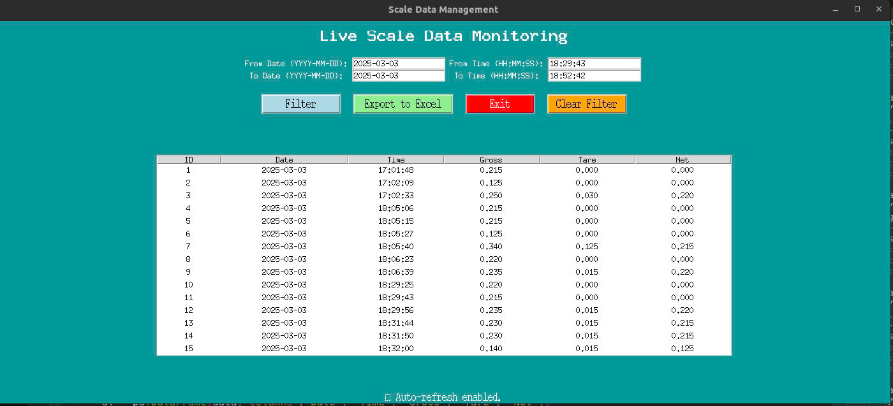

# Scale Data Logging & Management System

This project provides a complete solution for **real-time data acquisition from industrial scales (Mettler Toledo Scales)** via RS232/USB COM ports and saving the data into a **local MySQL database**, with a clean and user-friendly **Tkinter-based GUI** for filtering, exporting, and managing weight data (Gross, Tare, Net).

---

## 🔧 Features

* Connect to **any serial-enabled scale** (COM port, USB-RS232).
* Automatically parse scale output: `Date`, `Time`, `Gross`, `Tare`, `Net`.
* Save each valid measurement into a **MySQL database**.
* Clean **Tkinter GUI** to:

  * Filter by date/time.
  * Export to CSV/Excel.
  * Live monitor new data.
* Easy-to-deploy, standalone Python scripts.

---

## 🗂️ Project Structure

```
📁 ScaleLoggerProject/
├── Connect_to_scale.py      # Serial reader + MySQL logger
├── store_dataMYSQL.py       # DB connection + Insert/Fetch
├── GUI.py                   # Main application UI
├── Full_UI.jpg              # UI Screenshot
└── README.md
```

---

## ⚙️ Requirements

Install dependencies via pip:

```bash
pip install pyserial mysql-connector-python pandas
```

Make sure **MySQL Server** is installed and running.

---

## 🛠️ Database Setup

Run the following SQL commands in your MySQL client to create the database and table:

```sql
CREATE DATABASE Scale_project;

USE Scale_project;

CREATE TABLE measurements (
    id INT AUTO_INCREMENT PRIMARY KEY,
    date DATE,
    time TIME,
    gross FLOAT,
    tare FLOAT,
    net FLOAT
);
```

Update credentials in `store_dataMYSQL.py` if needed:

```python
host="localhost",
user="xxx",
password="xxx",
database="xxx"
```

---

## 🚀 How to Run

### 1. Connect Your Scale

Connect the scale to your computer using a COM port or USB-RS232 converter.

### 2. Launch the App

```bash
python GUI.py
```

* **Select COM Port and Baud Rate** from the dropdown.
* Click `▶ Start Scale` to begin reading.
* Live data will appear in the table.
* Use **Filter** or **Export to Excel** as needed.

---

## Demo Run

To test without hardware, simulate serial input using a virtual port or edit `Connect_to_scale.py` to read from a file for demo purposes.

## 📊 Sample Scale Data

| Date       | Time           | Gross | Tare   | Net   |
|------------|----------------|--------|--------|--------|
| 3/3/2025   | 18:52:42       | 0.220  | 0.000  | 0.000 |
| 3/3/2025   | 18:50:46       | 0.215  | 0.000  | 0.000 |
| 3/3/2025   | 18:50:35       | 0.220  | 0.000  | 0.000 |
| 3/3/2025   | 18:50:24       | 0.230  | 0.015  | 0.215 |


---

## 📌 Notes

* Ensure correct **COM port and baud rate** (e.g., 9600).
* The software expects incoming serial lines with recognizable tags like `Gross`, `Tare`, `Net`, `Date`, `Time`.
* Serial parsing is robust for most formatted outputs with spacing (e.g., `Gross 12.3 kg`).

---

## Sample Screenshot

> Below is the main GUI used in actual deployment:


